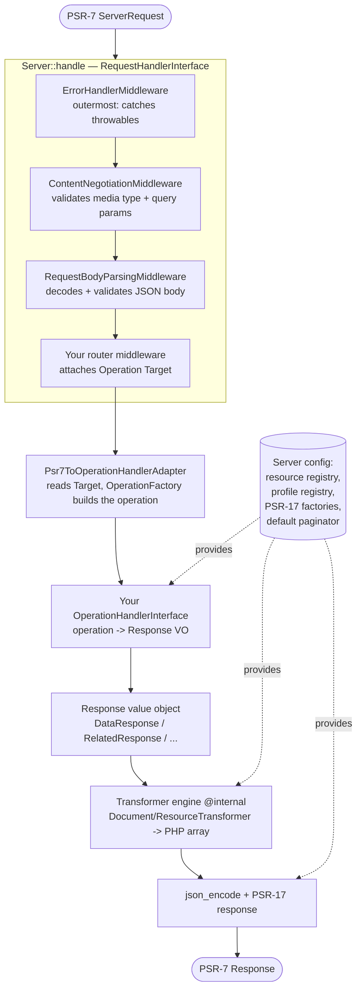

# Architecture: how a request flows through the library

This page traces a request through `haddowg/json-api` from PSR-7 in to PSR-7 out,
and names the part responsible at each step. Read it once to build a system model;
come back to it when you need the internals map. It is the one page where the
library's internal machinery is named — always as a labelled aside, never as
something you call.

## The library is a PSR-15 application

A server-side JSON:API request is, at bottom, a PSR-7 `ServerRequestInterface` in
and a PSR-7 `ResponseInterface` out. Everything between — content negotiation, body
parsing, error handling, operation dispatch, serialization, and encoding — is
composed from small, independently replaceable parts. Nothing in the chain assumes
a framework, an ORM, or a particular HTTP stack; you supply the PSR-7/PSR-17
implementation (the examples use `nyholm/psr7`) and the routing.

## The Server is the configuration root

A [`Server`](server.md) is the immutable configuration root for **one** API
version. Every `with…()` / `register()` call returns a new instance, so you build
one fluently and hold onto it. It carries:

- the **resource registry** — type → resource class, plus per-type serializer /
  hydrator overrides, standalone serializer/hydrator pairs, and operation
  allow-lists (it is also the resolver relationships use to serialize related
  types);
- the **profile registry** — registered [profiles](profiles.md) keyed by URI;
- the **PSR-17 factories** — used to build the PSR-7 response and its body stream;
- the **default paginator** and document-level defaults (`baseUri`,
  `jsonApiVersion`, `defaultMeta`, `encodeOptions`);
- the **ordered middleware list** and the **inner handler**.

You assemble one with `Server::make()`, as the example app's [`bootstrap`](../examples/music-catalog/src/bootstrap.php)
does. The snippet below carries more than the minimal albums slice that
[Getting started](getting-started.md) builds — the default paginator, a profile, a
per-type serializer override, and a standalone serializer/hydrator pair are all
**optional** features, each covered on the [Server](server.md) page (and in
[Pagination](pagination.md), [Profiles](profiles.md), and
[Serializers](serializers.md)); the only essentials here are `withPsr17()` and the
`register()` calls:

```php
$base = Server::make()
    ->withBaseUri('https://music.example')
    ->withPsr17($psr17, $psr17)
    ->withDefaultPaginator(PagePaginator::make()->withDefaultPerPage(10))
    ->withProfile(new TimestampProfile())
    // …
    ->register(ArtistResource::class)
    ->register(TrackResource::class, serializer: TrackSerializer::class)
    ->registerSerializerHydrator('charts', serializer: ChartSerializer::class);

$server = $base
    ->withMiddleware([
        new ErrorHandlerMiddleware($base, $debug),
        new ContentNegotiationMiddleware(),
        new RequestBodyParsingMiddleware(),
        new PathPrefixRouter($base),
    ])
    ->withHandler(new MusicCatalogHandler($repository));
```

Because `Server` is an immutable value, you can hold **several** — one per API
version — and let your framework's routing pick which one handles a given request.
See [Multiple servers and versioning](server.md) for that story; the full
configuration surface is on the [Server](server.md) page.

### Two dispatch entry points

`Server` implements PSR-15 `RequestHandlerInterface`, so the everyday entry point
is a single call:

```php
$response = $server->handle($request);   // full PSR-15 chain
```

`handle()` runs the **whole** middleware chain (negotiation, parsing, error
handling, routing) and then your handler.

For programmatic use where you have already built an operation — and want to skip
the middleware — there is a second entry point:

```php
$response = $server->dispatch($operation);   // bypasses middleware
```

`dispatch()` invokes the configured [operation handler](operations.md#operationhandlerinterface-the-one-seam)
directly with a pre-constructed, complete `JsonApiOperationInterface`. There is no
HTTP message, no negotiation, and no body parsing — you are responsible for the
operation being valid. Use it for in-process composition and tests; use `handle()`
for real requests.

## Request flow



### Stage 1 — the middleware chain

`Server::handle()` folds the configured middleware list over the inner handler —
wrapping each middleware (outermost last in the array) around the next — and runs
the result. The bootstrap above lists all four explicitly because it slots a
router; the [`JsonApiMiddleware`](middleware.md#the-aggregate) aggregate wires the
first three core middleware for you when you do not need to manage their ordering
(the router is always your own). The recommended order is, outermost first:

1. **`ErrorHandlerMiddleware`** — wraps everything in a `try`/`catch`. Any
   [typed exception](errors-and-exceptions.md) thrown downstream becomes a JSON:API
   [error document](errors-and-exceptions.md); any other throwable becomes a generic 500. A
   successful response passes through untouched. It must be outermost so it catches
   negotiation, parsing, and handler throwables alike.
2. **`ContentNegotiationMiddleware`** — validates the `Content-Type` and `Accept`
   headers and the JSON:API query parameters, throwing the matching typed
   exception on a violation.
3. **`RequestBodyParsingMiddleware`** — forces the JSON body to parse and validates
   its top-level members when a body is present (bodyless requests are skipped),
   surfacing a malformed or non-conformant body as a typed exception.
4. **Your router** — core ships no router. A router's only job here is to attach an
   [`Operation\Target`](operations.md#target) to the request as an
   attribute keyed by `Target::class`. The example's toy
   [`PathPrefixRouter`](../examples/music-catalog/src/Http/PathPrefixRouter.php)
   shows the contract; in a real app your framework's router does this.

**The wrap-once `JsonApiRequest`.** The parsed request flows down the chain by
being *swapped in place*. The first middleware that needs the parse wraps the
PSR-7 request in a `JsonApiRequest` — which **is** a `ServerRequestInterface`, so
the wrap is transparent — and passes that instance downstream. The wrap is
idempotent: each middleware does `$request instanceof JsonApiRequestInterface ?
$request : new JsonApiRequest($request)`, so once content negotiation has wrapped
it, body parsing's wrap is a no-op. The result is that parsing (and the lazy-cached
query-parameter groups) happens **once** and is shared by everything downstream,
including your handler.

### Stage 2 — the adapter

`Operation\Psr7ToOperationHandlerAdapter` is the bridge from PSR-15 to the
operations layer. It reads the `Target` attribute, then hands the parsed request,
target, and context to `Operation\OperationFactory`, which selects **one of nine**
concrete operations from a fixed *HTTP-method × target-shape* match table:

| Request | Operation |
| --- | --- |
| `GET /tracks` or `GET /tracks/1` | `FetchResourceOperation` |
| `GET /albums/1/tracks` | `FetchRelatedOperation` |
| `GET /albums/1/relationships/tracks` | `FetchRelationshipOperation` |
| `POST /albums` | `CreateResourceOperation` |
| `PATCH /albums/1` | `UpdateResourceOperation` |
| `DELETE /albums/1` | `DeleteResourceOperation` |
| `PATCH /albums/1/relationships/tracks` | `UpdateRelationshipOperation` |
| `POST /albums/1/relationships/tracks` | `AddToRelationshipOperation` |
| `DELETE /albums/1/relationships/tracks` | `RemoveFromRelationshipOperation` |

The factory keys on `$target->hasRelationship()` and
`$target->isRelationshipEndpoint`; an unhandled HTTP method throws (a 500). If
routing failed to attach a `Target` at all, the **adapter** renders a 500 error
response rather than throwing — a missing target is a server-side wiring fault, not
a client error, but the PSR-15 contract still yields a JSON:API response.

### Stage 3 — the operation handler

Your [`OperationHandlerInterface`](operations.md#operationhandlerinterface-the-one-seam) receives the parsed
`JsonApiOperationInterface` and returns one of the
[response value objects](responses.md). It is **PSR-7-free**: you dispatch on the
concrete operation type with `match (true)`, do your application work, and return a
response. You reach the resource / serializer / hydrator registry through
`$operation->context()->server` (narrowed to the concrete `Server`). The example's
[`MusicCatalogHandler`](../examples/music-catalog/src/Handler/MusicCatalogHandler.php)
is one such handler — a single `match (true)` over all nine operations:

```php
public function handle(JsonApiOperationInterface $operation): /* … */ {
    return match (true) {
        $operation instanceof FetchResourceOperation => $this->fetch($operation),
        $operation instanceof CreateResourceOperation => $this->create($operation),
        // …
        default => ErrorResponse::fromException(new ResourceNotFound()),
    };
}
```

Because every typed exception propagates up to the `ErrorHandlerMiddleware`, the
handler never has to catch JSON:API errors itself — it throws (or returns
`ErrorResponse::fromException(...)`) and the middleware renders the right status.
See [Getting started](getting-started.md) for this handler built from scratch and
[Operations and dispatch](operations.md#operationhandlerinterface-the-one-seam) for the operation surface.

### Stage 4 — the serialization engine

The response value object owns rendering. Its `render()` builds an `@internal`
document and runs it through the **transformer engine** (the `Transformer\*`
classes — `DocumentTransformer`, `ResourceTransformer`, and the per-pass
`*Transformation` state objects). The engine is **serializer-free**: every
transformation returns a plain PHP **array**, not JSON. It is where the
spec-sensitive logic lives — compound-document `included`, sparse fieldsets, and
included-resource deduplication — and it is entirely `@internal`. You interact with
it only through resource classes and response value objects, never directly.

### Stage 5 — encoding

`AbstractResponse::toPsrResponse()` takes the body array the engine produced,
applies any in-scope [profiles](profiles.md#how-applied-profiles-are-surfaced),
`json_encode`s it (with `JSON_THROW_ON_ERROR` and the server's encode options),
and builds the PSR-7 response via the server's PSR-17 factories with a fixed
`Content-Type: application/vnd.api+json`. JSON encoding happens **only** here, once,
at the very end — never inside the engine.

## Why this shape

The split keeps each concern replaceable:

- the **handler** is pure application logic with no transport coupling;
- the **engine** is pure data-to-data transformation with no encoding coupling;
- **encoding and HTTP framing** live in one place;
- the **`Server`** is an immutable value, so one process can hold one per API
  version and route between them.

Each middleware, the router, the operation handler, the paginator, and every
resource is a small contract you can swap without touching the others.

## Aside: the internal parts

These are named here so you can recognise them in a stack trace — they are
`@internal` and carry no backwards-compatibility guarantee. You never construct or
call them:

| Internal part | Where it lives | What it does |
| --- | --- | --- |
| Transformer engine | `Transformer\DocumentTransformer`, `Transformer\ResourceTransformer`, `Transformer\*Transformation` | Renders a response VO's document to a plain PHP array |
| Document classes | `Schema\Document\*` (e.g. `SingleResourceDocument`, `CollectionDocument`, `ErrorDocument`) | The internal document model the engine transforms |
| Media-type scanner | `Request\MediaType` | Parses and validates `Content-Type` / `Accept` media types during negotiation |
| Query-parameter parsing | `Operation\QueryParameters`, the lazy caches on `Request\JsonApiRequest` | Reads `fields` / `include` / `sort` / `page` / `filter` from the request |
| Chain folding | `Server\Internal\MiddlewareDecorator` | Wraps one middleware around the next inside `Server::handle()` |

Everything else you touch — resources, serializers, hydrators, operations,
response value objects, exceptions — is public API.

## Next / See also

- [Server](server.md) — the full configuration surface, operations, routing, and
  multiple servers.
- [Middleware](middleware.md) — the PSR-15 suite, the `JsonApiMiddleware`
  aggregate, and ordering rationale.
- [Responses](responses.md) — the response value objects and how they render.
- [Concepts](concepts.md) — the JSON:API document model the engine produces.
- [Getting started](getting-started.md) — the request flow walked end to end as a
  first endpoint.
