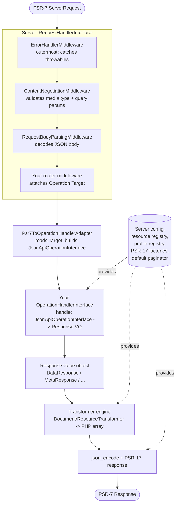

# Architecture

This page traces a request through `haddowg/json-api` end to end and names the
piece responsible at each step. The library is a PSR-15 application: a PSR-7
request goes in, a PSR-7 response comes out, and everything between — content
negotiation, body parsing, error handling, operation dispatch, serialization, and
encoding — is composed from small, independently testable parts. For the
configuration surface see [Server](server.md); for the middleware suite see
[Middleware](middleware.md); for the response value objects see
[Responses](responses.md).

## The configuration root

A [`Server`](server.md) is the configuration root for one API version. It is an
immutable value (every `with…()` / `register()` returns a new instance) that holds:

- the **resource registry** — type → Resource class (plus optional serializer/hydrator
  overrides); it is also the resolver relationships use to serialize related types;
- the **profile registry** — registered [profiles](profiles.md) keyed by URI;
- the **PSR-17 factories** — used to build the PSR-7 response and its body stream;
- the **default paginator** and document-level defaults (`baseUri`,
  `jsonApiVersion`, `defaultMeta`, `encodeOptions`);
- the **ordered middleware list** and the **inner handler**.

`Server` itself implements PSR-15 `RequestHandlerInterface`, so dispatching a
request is a single `$server->handle($request)` call. (It also exposes
`dispatch(JsonApiOperationInterface)` for programmatic, PSR-7-free invocation that bypasses
the middleware chain.)

## Request flow

### 1. The middleware chain

`Server::handle()` folds the configured middleware list over the inner handler and
runs it. The recommended order (the [`JsonApiMiddleware`](middleware.md) aggregate
wires it for you) is, outermost first:

1. **`ErrorHandlerMiddleware`** — wraps everything in a `try`/`catch`. Any
   [typed exception](exceptions.md) thrown downstream becomes a JSON:API
   [error document](errors.md); any other throwable becomes a generic 500. A
   successful PSR-7 response passes through untouched.
2. **`ContentNegotiationMiddleware`** — validates the `Content-Type` and `Accept`
   headers and the JSON:API query parameters, throwing the matching typed
   exception on a violation.
3. **`RequestBodyParsingMiddleware`** — forces the JSON body to parse and validates
   its top-level members when a body is present (skipping bodyless requests),
   surfacing a malformed or non-conformant body as a typed exception.
4. **Your router** — core ships no router. A router's only job here is to attach a
   [`Operation\Target`](server.md#routing-and-targets) to the request as an
   attribute keyed by `Target::class`.

The parsed request flows down the chain by being swapped in place: the first
middleware to need it wraps the PSR-7 request in a `JsonApiRequest` (idempotent —
a `JsonApiRequest` *is* a `ServerRequestInterface`) and passes that downstream, so
parsing happens once and is shared.

### 2. The adapter

`Operation\Psr7ToOperationHandlerAdapter` is the bridge from PSR-15 to the
operations layer. It reads the `Target` attribute, then selects a concrete
[operation](server.md#operations) from a fixed *HTTP-method × target-shape* match
table — `GET /articles/1` → `FetchResourceOperation`, `POST /articles` →
`CreateResourceOperation`, `GET /articles/1/relationships/author` →
`FetchRelationshipOperation`, and so on. If routing failed to attach a `Target`,
the adapter renders a 500 error response rather than throwing.

### 3. The operation handler

Your [`OperationHandlerInterface`](server.md#operations) receives the parsed
`JsonApiOperationInterface` and returns one of the [response value objects](responses.md).
It is PSR-7-free: dispatch on the concrete operation type with `match (true)`, do
your application work (reaching Resource classes through `$operation->context()->server`),
and return a response. See [Getting started](getting-started.md#the-operation-handler)
for a worked handler.

### 4. The serialization engine

The response value object owns rendering. Its `render()` builds an `@internal`
document and runs it through the **transformer engine** (`Transformer\*` —
`DocumentTransformer`, `ResourceTransformer`, and the per-pass `*Transformation`
state objects). The engine is **serializer-free**: every transformation returns a
plain PHP **array**, not JSON. It is where the spec-sensitive logic lives —
compound-document `included`, sparse fieldsets, included-resource deduplication —
and it is entirely `@internal`; consumers interact with it only through Resource classes and
response value objects.

### 5. Encoding

`AbstractResponse::toPsrResponse()` takes the body array the engine produced,
applies any in-scope [profiles](profiles.md#how-applied-profiles-are-surfaced), `json_encode`s it
(with `JSON_THROW_ON_ERROR` and the server's encode options), and builds the PSR-7
response via the server's PSR-17 factories with `Content-Type:
application/vnd.api+json`. JSON encoding happens *only* here, at the very end —
never inside the engine.

## Why this shape

The split keeps each concern replaceable. The handler is pure application logic
with no transport coupling. The engine is pure data-to-data transformation with no
encoding coupling. Encoding and HTTP framing live in one place. And because
`Server` is an immutable value, you can hold several — one per API version — and
let your framework's routing pick which one handles a given request.

## Related pages

- [Server](server.md) — the configuration root, operations, and routing.
- [Middleware](middleware.md) — the PSR-15 suite and ordering rationale.
- [Responses](responses.md) — the response value objects and rendering.
- [Concepts](concepts.md) — the document model the engine produces.
- [Documentation index](README.md) — the full page list.
